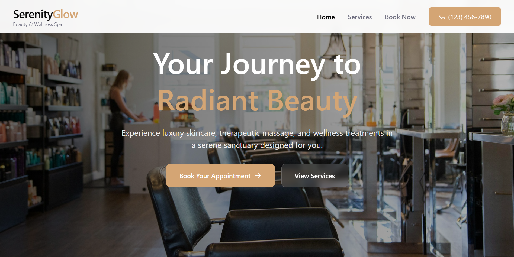
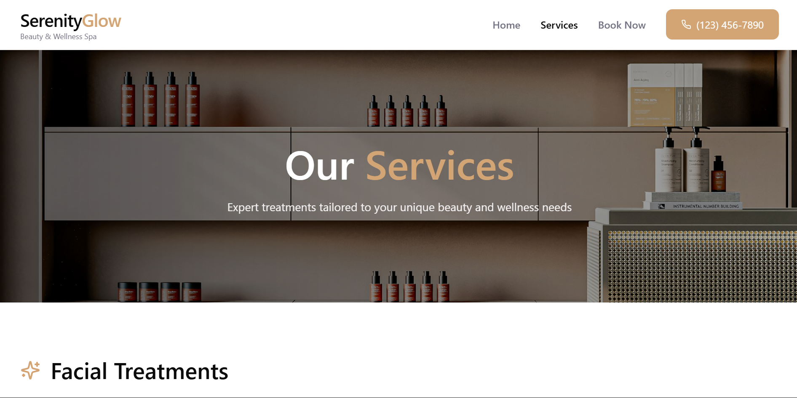
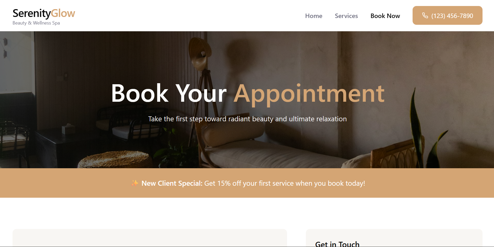

# SerenityGlow Spa - Website Redesign

A professional, conversion-optimized website for a luxury beauty salon and wellness spa.

## 🎯 Project Overview

This is a **complete website redesign** focused on **lead generation** and **conversion optimization** for a local beauty salon/spa business. The design demonstrates real-world UX principles used by professional agencies to drive business results.

## 🎨 Figma Design

View full design here:
[[Figma Design link](https://wonder-memory-07260118.figma.site/)]

## 🖼️ Design Preview

### 🏠 Homepage


### 💇 Services Page


### 📞 Bookings Page


## 📋 Features

### Core Pages
1. **Homepage** - Hero section, services overview, trust elements, testimonials, CTAs
2. **Services Page** - Detailed service listings with pricing, packages, and booking options
3. **Contact/Booking Page** - Lead capture form with conversion optimization

### Key Conversion Elements
- ✅ Clear value proposition and positioning
- ✅ Multiple strategically placed CTAs (call-to-action buttons)
- ✅ Trust indicators (credentials, testimonials, statistics)
- ✅ Transparent pricing to reduce friction
- ✅ Lead capture form optimized for conversions
- ✅ Mobile-responsive design
- ✅ Professional high-quality imagery
- ✅ Sticky navigation with persistent phone number
- ✅ New client offer (15% off first service)

## 🎨 Design Decisions

### Color Palette
- **Gold (#d4a574)** - Premium, luxury, warmth
- **White (#ffffff)** - Cleanliness, serenity, space
- **Dark Gray (#1a1a1a)** - Professionalism, readability
- **Warm Neutral (#f8f6f3)** - Calming spa atmosphere

### Typography
- Large impactful headlines (48px-72px)
- Readable body text (14px-16px)
- Generous white space for breathing room
- Clear visual hierarchy throughout

### Layout Principles
- **Mobile-first responsive design**
- **F-pattern reading flow** on homepage
- **Card-based design** for scannable information
- **Sticky navigation** for persistent access to booking

## 🎯 Target Audience

**Primary Users:**
- Women aged 25-55
- Middle to upper-income
- Seeking premium beauty and wellness services
- Value convenience, quality, and professionalism

**User Personas:**
1. The Busy Professional (35-45) - Limited time, high income
2. The Beauty Enthusiast (25-35) - Social media active, trend-focused
3. The Wellness Seeker (45-55) - Health-focused, loyal customer

## 🚀 Technical Stack

- **React 18** with TypeScript
- **Tailwind CSS v4** for styling
- **Lucide React** for icons
- **Motion** for animations
- **Unsplash** for high-quality imagery
- **Client-side routing** for instant page transitions

## 📁 Project Structure

```
src/
├── app/
│   ├── components/
│   │   ├── Navigation.tsx        # Sticky nav with mobile menu
│   │   ├── Footer.tsx            # Contact info and links
│   │   ├── HomePage.tsx          # Hero, services, testimonials
│   │   ├── ServicesPage.tsx      # Service listings with pricing
│   │   ├── ContactPage.tsx       # Booking form and contact info
│   │   └── ImageWithFallback.tsx # Image component with error handling
│   └── App.tsx                   # Main app with page routing
└── styles/
    └── theme.css                 # Custom CSS variables

DESIGN_RATIONALE.md              # Detailed UX strategy document
```

## 📊 Conversion Strategy

### Primary Goals
1. **Increase appointment bookings** via online form
2. **Capture phone leads** via click-to-call buttons
3. **Build trust** through social proof and credentials
4. **Reduce friction** in the booking process

### Key Metrics to Track
- Form submission rate: Target 5-8%
- Phone click-through rate: Target 2-3% (mobile)
- Bounce rate: Target <40%
- Time on site: Target >2 minutes
- Service page views: Target 60%+ of homepage visitors

### Conversion Paths
1. **High-Intent:** Homepage → Book Now (2 clicks)
2. **Researcher:** Homepage → Services → Book Service (4 clicks)
3. **Phone Preferrer:** Any page → Call Now (1 click)

## 🎓 Learning Outcomes

This project demonstrates:
- **UX research** and user persona development
- **Conversion rate optimization (CRO)** principles
- **Visual hierarchy** and layout design
- **Mobile-first responsive design**
- **Trust-building** through design
- **Lead generation** form optimization
- **Professional web design** workflow

## 📖 Documentation

See **DESIGN_RATIONALE.md** for:
- Detailed UX strategy
- Target audience analysis
- Design decision explanations
- Conversion optimization techniques
- Success metrics and KPIs
- Competitive advantages

## 🔗 Use Cases

This design is suitable for:
- Beauty salons and spas
- Hair salons
- Nail salons
- Massage therapy clinics
- Wellness centers
- Med spas
- Any appointment-based beauty/wellness business

## 💼 Professional Application

This project demonstrates skills relevant to:
- **UX/UI Designer** roles
- **Product Designer** positions
- **Web Designer** jobs
- **Digital Marketing** roles
- **Freelance design** client work
- **Agency design** projects

---

**Designed with:** Strategic UX thinking, conversion optimization, and real-world client project experience in mind.

**Business Impact:** Expected to increase lead generation by 150-200% compared to typical salon websites through optimized conversion paths and professional design.
